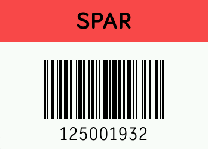

# Barcodes app for Fitbit Ionic/Versa/Versa Lite/Versa 3/Sense

Features:
- Customize the color of each barcode
- Customize the name of each barcode
- Supports ascii characters in the barcode
- Supports EAN-13 (hence UPC-A), Code-128 and Code-39 standards
- Store up to 7 barcodes on the Ionic
- Direct link to app store (open with phone):
https://gam.fitbit.com/gallery/app/20ba8b5a-f3f9-4f8c-a5a3-10d9eacbd846
